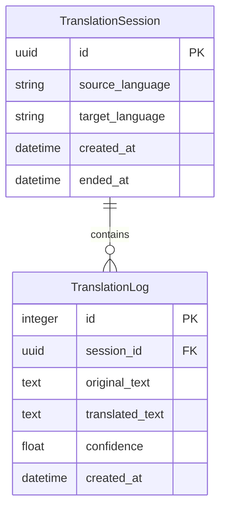

# LiveSub - 데이터 모델

---

## ER 다이어그램



---

## 엔티티 상세

### TranslationSession (번역 세션)

| 필드명 | 타입 | PK | FK | Nullable | 기본값 | 제약조건 | 설명 |
|--------|------|----|----|----------|--------|----------|------|
| id | UUID | Y | - | N | uuid4() 자동 생성 | UNIQUE | 세션 고유 식별자 |
| source_language | VARCHAR(10) | - | - | N | - | NOT NULL, max_length=10 | 원본 언어 코드 (예: "ko", "en-US") |
| target_language | VARCHAR(10) | - | - | N | - | NOT NULL, max_length=10 | 번역 대상 언어 코드 (예: "en", "ja") |
| created_at | DATETIME | - | - | N | 현재 UTC 시각 | NOT NULL | 세션 생성 시각 |
| ended_at | DATETIME | - | - | Y | NULL | - | 세션 종료 시각 (NULL이면 진행 중) |

### TranslationLog (번역 기록)

| 필드명 | 타입 | PK | FK | Nullable | 기본값 | 제약조건 | 설명 |
|--------|------|----|----|----------|--------|----------|------|
| id | INTEGER | Y | - | N | AUTOINCREMENT | UNIQUE | 기록 고유 식별자 |
| session_id | UUID | - | TranslationSession.id | N | - | NOT NULL, FK | 소속 세션 |
| original_text | TEXT | - | - | N | - | NOT NULL | 원본 인식 텍스트 |
| translated_text | TEXT | - | - | N | - | NOT NULL | 번역된 텍스트 |
| confidence | REAL | - | - | Y | NULL | CHECK(confidence >= 0.0 AND confidence <= 1.0) | 음성 인식 신뢰도 |
| created_at | DATETIME | - | - | N | 현재 UTC 시각 | NOT NULL | 기록 생성 시각 |

### 관계

- **TranslationSession 1 : N TranslationLog**
  - TranslationLog.session_id -> TranslationSession.id
  - ON DELETE: CASCADE (세션 삭제 시 로그도 삭제)

---

## 인덱스 전략

| 인덱스명 | 테이블 | 필드 | 타입 | 사유 |
|----------|--------|------|------|------|
| pk_session_id | TranslationSession | id | PRIMARY KEY (자동) | PK 조회 |
| idx_session_created_at | TranslationSession | created_at | INDEX | 세션 목록 최신순 정렬 시 사용 |
| pk_log_id | TranslationLog | id | PRIMARY KEY (자동) | PK 조회 |
| idx_log_session_id | TranslationLog | session_id | INDEX | 특정 세션의 로그 조회 시 FK 조인 최적화 |
| idx_log_created_at | TranslationLog | created_at | INDEX | 로그를 시간순 정렬 조회 시 사용 |

**인덱스 설계 근거**:
- `idx_log_session_id`: 가장 빈번한 쿼리인 "세션별 로그 조회"에서 필수. 모든 로그 조회 API가 session_id로 필터링함
- `idx_session_created_at`: 세션 목록을 최신순으로 조회할 때 사용. 현재 API에 세션 목록 조회는 없으나, 향후 확장 대비
- `idx_log_created_at`: 로그를 시간순으로 정렬하여 반환할 때 사용

---

## DDL (SQLite)

```sql
CREATE TABLE IF NOT EXISTS translation_sessions (
    id TEXT PRIMARY KEY,
    source_language VARCHAR(10) NOT NULL,
    target_language VARCHAR(10) NOT NULL,
    created_at DATETIME NOT NULL DEFAULT (datetime('now')),
    ended_at DATETIME
);

CREATE INDEX IF NOT EXISTS idx_session_created_at
    ON translation_sessions(created_at);

CREATE TABLE IF NOT EXISTS translation_logs (
    id INTEGER PRIMARY KEY AUTOINCREMENT,
    session_id TEXT NOT NULL,
    original_text TEXT NOT NULL,
    translated_text TEXT NOT NULL,
    confidence REAL CHECK(confidence IS NULL OR (confidence >= 0.0 AND confidence <= 1.0)),
    created_at DATETIME NOT NULL DEFAULT (datetime('now')),
    FOREIGN KEY (session_id) REFERENCES translation_sessions(id) ON DELETE CASCADE
);

CREATE INDEX IF NOT EXISTS idx_log_session_id
    ON translation_logs(session_id);

CREATE INDEX IF NOT EXISTS idx_log_created_at
    ON translation_logs(created_at);
```

**SQLite 참고사항**:
- SQLite에는 네이티브 UUID 타입이 없으므로 TEXT로 저장한다. Python에서 uuid4()로 생성 후 문자열로 변환하여 저장.
- DATETIME도 TEXT로 저장되며, ISO 8601 형식("YYYY-MM-DDTHH:MM:SSZ")을 사용한다.
- `PRAGMA foreign_keys = ON;`을 연결 시 설정해야 FK 제약조건이 동작한다.

---

## SQLAlchemy 모델 (FastAPI용)

```python
import uuid
from datetime import datetime, timezone
from sqlalchemy import Column, String, Text, Float, Integer, DateTime, ForeignKey
from sqlalchemy.orm import relationship, DeclarativeBase


class Base(DeclarativeBase):
    pass


class TranslationSession(Base):
    __tablename__ = "translation_sessions"

    id: str = Column(String, primary_key=True, default=lambda: str(uuid.uuid4()))
    source_language: str = Column(String(10), nullable=False)
    target_language: str = Column(String(10), nullable=False)
    created_at: datetime = Column(DateTime, nullable=False, default=lambda: datetime.now(timezone.utc))
    ended_at: datetime | None = Column(DateTime, nullable=True)

    logs = relationship("TranslationLog", back_populates="session", cascade="all, delete-orphan")


class TranslationLog(Base):
    __tablename__ = "translation_logs"

    id: int = Column(Integer, primary_key=True, autoincrement=True)
    session_id: str = Column(String, ForeignKey("translation_sessions.id", ondelete="CASCADE"), nullable=False)
    original_text: str = Column(Text, nullable=False)
    translated_text: str = Column(Text, nullable=False)
    confidence: float | None = Column(Float, nullable=True)
    created_at: datetime = Column(DateTime, nullable=False, default=lambda: datetime.now(timezone.utc))

    session = relationship("TranslationSession", back_populates="logs")
```
