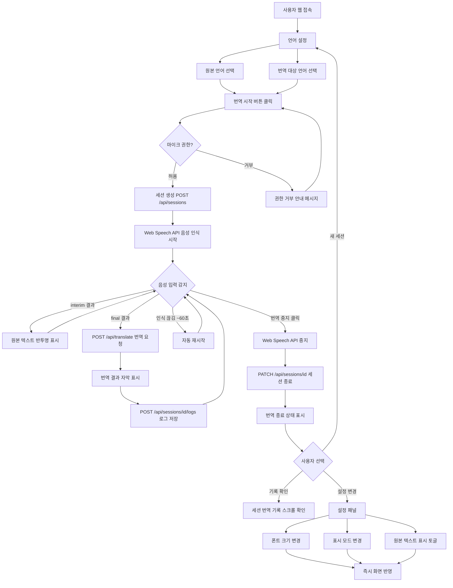
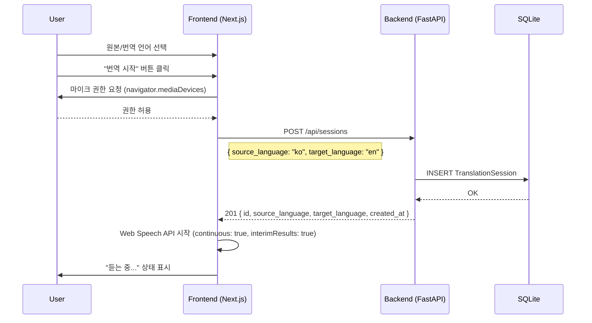
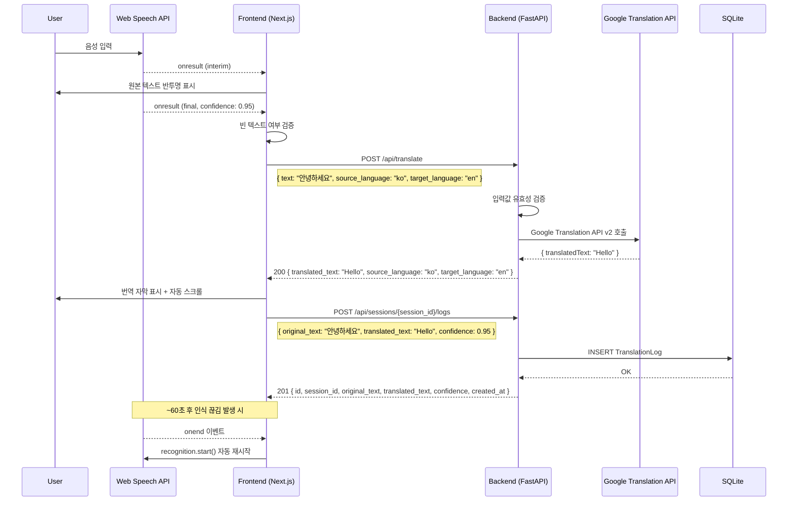
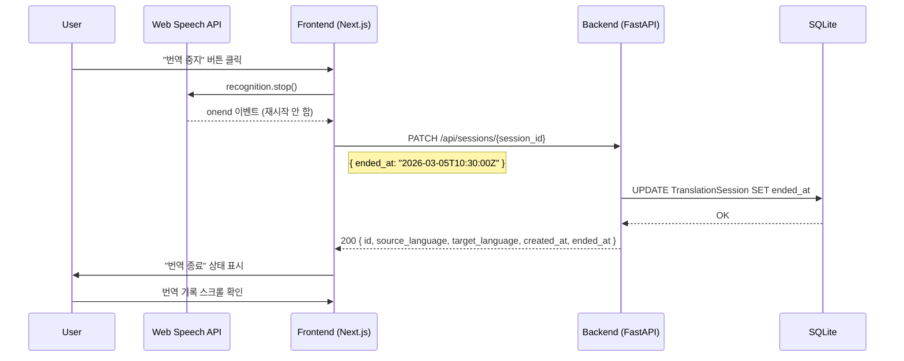
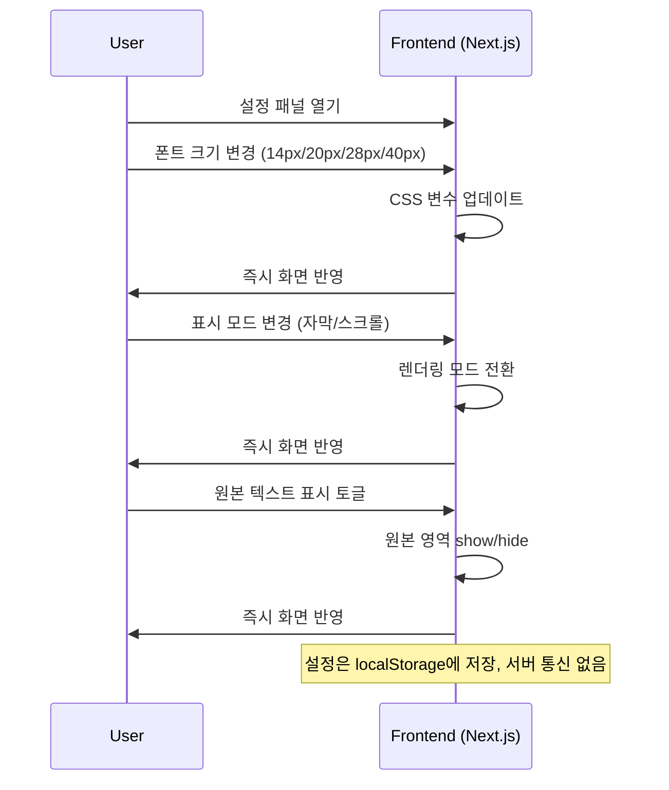
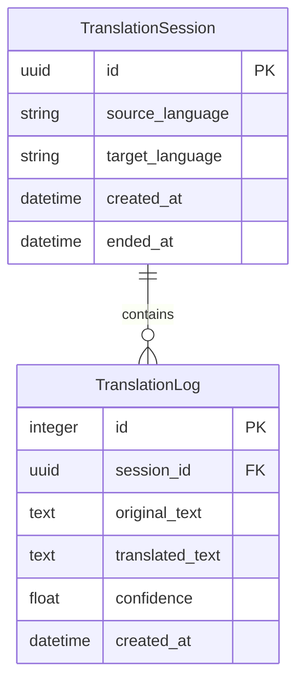
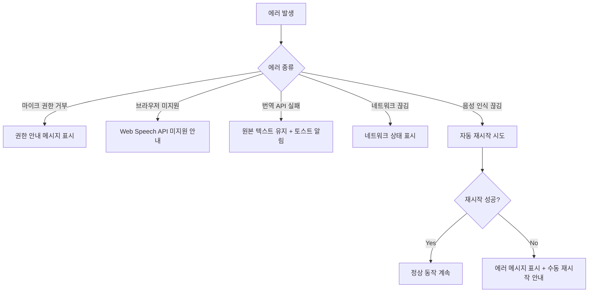

# LiveSub - 서비스 플로우

---

## 전체 서비스 플로우

```mermaid
flowchart TD
    A[사용자 웹 접속] --> B[언어 설정]
    B --> B1[원본 언어 선택]
    B --> B2[번역 대상 언어 선택]
    B1 --> C[번역 시작 버튼 클릭]
    B2 --> C
    C --> D{마이크 권한?}
    D -->|허용| E[세션 생성 POST /api/sessions]
    D -->|거부| F[권한 거부 안내 메시지]
    F --> C
    E --> G[Web Speech API 음성 인식 시작]
    G --> H{음성 입력 감지}
    H -->|interim 결과| I[원본 텍스트 반투명 표시]
    H -->|final 결과| J[POST /api/translate 번역 요청]
    I --> H
    J --> K[번역 결과 자막 표시]
    K --> L[POST /api/sessions/id/logs 로그 저장]
    L --> H
    H -->|인식 끊김 ~60초| M[자동 재시작]
    M --> H
    H -->|번역 중지 클릭| N[Web Speech API 중지]
    N --> O[PATCH /api/sessions/id 세션 종료]
    O --> P[번역 종료 상태 표시]
    P --> Q{사용자 선택}
    Q -->|기록 확인| R[세션 번역 기록 스크롤 확인]
    Q -->|새 세션| B
    Q -->|설정 변경| S[설정 패널]
    S --> S1[폰트 크기 변경]
    S --> S2[표시 모드 변경]
    S --> S3[원본 텍스트 표시 토글]
    S1 --> T[즉시 화면 반영]
    S2 --> T
    S3 --> T
```

---

## 시나리오 1: 번역 시작

```mermaid
sequenceDiagram
    participant U as User
    participant F as Frontend (Next.js)
    participant B as Backend (FastAPI)
    participant DB as SQLite

    U->>F: 원본/번역 언어 선택
    U->>F: "번역 시작" 버튼 클릭
    F->>U: 마이크 권한 요청 (navigator.mediaDevices)
    U-->>F: 권한 허용

    F->>B: POST /api/sessions
    Note right of F: { source_language: "ko", target_language: "en" }
    B->>DB: INSERT TranslationSession
    DB-->>B: OK
    B-->>F: 201 { id, source_language, target_language, created_at }

    F->>F: Web Speech API 시작 (continuous: true, interimResults: true)
    F->>U: "듣는 중..." 상태 표시
```

---

## 시나리오 2: 실시간 번역

```mermaid
sequenceDiagram
    participant U as User
    participant WSA as Web Speech API
    participant F as Frontend (Next.js)
    participant B as Backend (FastAPI)
    participant G as Google Translation API
    participant DB as SQLite

    U->>WSA: 음성 입력
    WSA-->>F: onresult (interim)
    F->>U: 원본 텍스트 반투명 표시

    WSA-->>F: onresult (final, confidence: 0.95)
    F->>F: 빈 텍스트 여부 검증

    F->>B: POST /api/translate
    Note right of F: { text: "안녕하세요", source_language: "ko", target_language: "en" }
    B->>B: 입력값 유효성 검증
    B->>G: Google Translation API v2 호출
    G-->>B: { translatedText: "Hello" }
    B-->>F: 200 { translated_text: "Hello", source_language: "ko", target_language: "en" }

    F->>U: 번역 자막 표시 + 자동 스크롤

    F->>B: POST /api/sessions/{session_id}/logs
    Note right of F: { original_text: "안녕하세요", translated_text: "Hello", confidence: 0.95 }
    B->>DB: INSERT TranslationLog
    DB-->>B: OK
    B-->>F: 201 { id, session_id, original_text, translated_text, confidence, created_at }

    Note over WSA,F: ~60초 후 인식 끊김 발생 시
    WSA-->>F: onend 이벤트
    F->>WSA: recognition.start() 자동 재시작
```

---

## 시나리오 3: 번역 중지

```mermaid
sequenceDiagram
    participant U as User
    participant WSA as Web Speech API
    participant F as Frontend (Next.js)
    participant B as Backend (FastAPI)
    participant DB as SQLite

    U->>F: "번역 중지" 버튼 클릭
    F->>WSA: recognition.stop()
    WSA-->>F: onend 이벤트 (재시작 안 함)

    F->>B: PATCH /api/sessions/{session_id}
    Note right of F: { ended_at: "2026-03-05T10:30:00Z" }
    B->>DB: UPDATE TranslationSession SET ended_at
    DB-->>B: OK
    B-->>F: 200 { id, source_language, target_language, created_at, ended_at }

    F->>U: "번역 종료" 상태 표시
    U->>F: 번역 기록 스크롤 확인
```

---

## 시나리오 4: 설정 변경

```mermaid
sequenceDiagram
    participant U as User
    participant F as Frontend (Next.js)

    U->>F: 설정 패널 열기
    U->>F: 폰트 크기 변경 (14px/20px/28px/40px)
    F->>F: CSS 변수 업데이트
    F->>U: 즉시 화면 반영

    U->>F: 표시 모드 변경 (자막/스크롤)
    F->>F: 렌더링 모드 전환
    F->>U: 즉시 화면 반영

    U->>F: 원본 텍스트 표시 토글
    F->>F: 원본 영역 show/hide
    F->>U: 즉시 화면 반영

    Note over F: 설정은 localStorage에 저장, 서버 통신 없음
```

---

## 데이터 모델 ERD

```mermaid
erDiagram
    TranslationSession ||--o{ TranslationLog : contains
    TranslationSession {
        uuid id PK
        string source_language
        string target_language
        datetime created_at
        datetime ended_at
    }
    TranslationLog {
        integer id PK
        uuid session_id FK
        text original_text
        text translated_text
        float confidence
        datetime created_at
    }
```

---

## 에러 처리 플로우

```mermaid
flowchart TD
    A[에러 발생] --> B{에러 종류}
    B -->|마이크 권한 거부| C[권한 안내 메시지 표시]
    B -->|브라우저 미지원| D[Web Speech API 미지원 안내]
    B -->|번역 API 실패| E[원본 텍스트 유지 + 토스트 알림]
    B -->|네트워크 끊김| F[네트워크 상태 표시]
    B -->|음성 인식 끊김| G[자동 재시작 시도]
    G --> H{재시작 성공?}
    H -->|Yes| I[정상 동작 계속]
    H -->|No| J[에러 메시지 표시 + 수동 재시작 안내]
```
